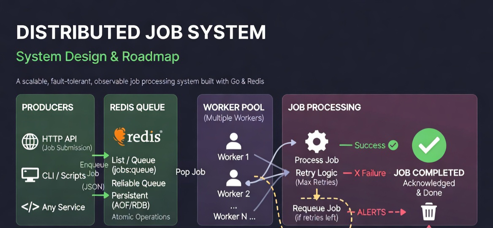
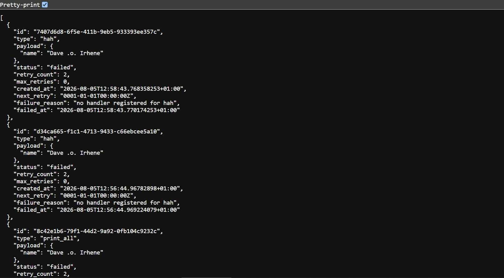
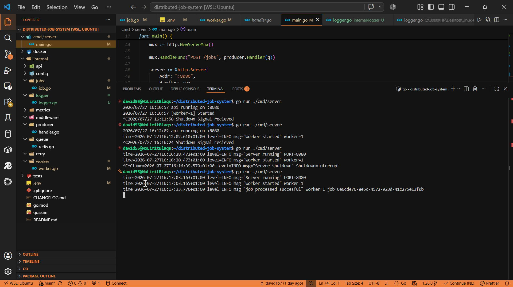
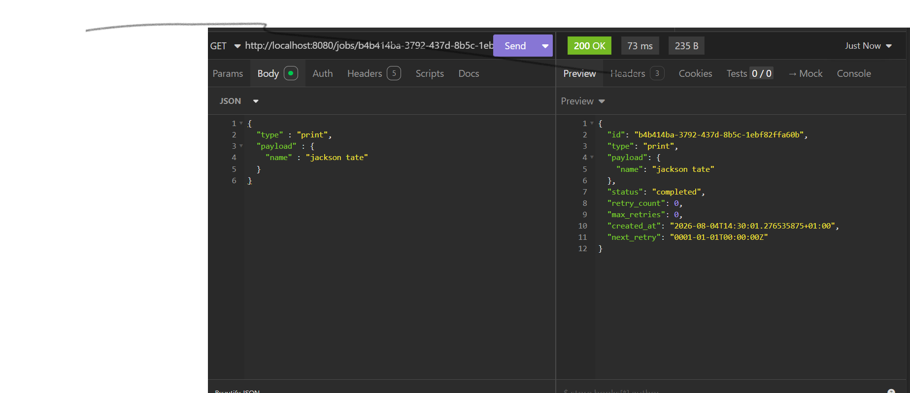

# Distributed Job Queue

> **Version:** `v0.2.0`

A production-inspired distributed job queue built with Go.

Instead of jumping straight into Kafka or RabbitMQ, I'm rebuilding the core concepts from scratch to understand *why* modern message brokers are designed the way they are.

The goal isn't to clone existing tools—it's to learn the engineering behind them.

---

# Tech Stack

- Go
- Redis
- Docker
- Goroutines
- Context
- slog

### Planned

- RabbitMQ
- Kafka
- Prometheus
- Grafana
- PostgreSQL
- Docker Compose
- Kubernetes

---

# Architecture



---

# Demo (DLQ ENDPOINT, CODE EXECUTING GIF, TESTED JOBS ENDPOINT )
 





---

# Features

### Current

- Redis-backed queue
- Concurrent worker pool
- Configurable worker count
- Retry mechanism
- Exponential backoff
- Graceful shutdown
- Context cancellation
- Structured logging (`slog`)
- Job status endpoint (`GET /jobs/{id}`)
- Job persistence in Redis
- Dead Letter Queue (DLQ)
- Dead Letter Queue endpoint (`GET /dead-jobs`)

### Coming Soon

- Delayed jobs
- Scheduled jobs
- Job priorities
- Queue metrics
- Worker health checks
- Kafka integration
- RabbitMQ integration

---

# Why I Built This

I wanted to understand what actually happens behind systems like:

- RabbitMQ
- Kafka
- AWS SQS
- BullMQ
- Sidekiq

Instead of treating them as black boxes, I'm rebuilding many of their core ideas one feature at a time.

---

# What I've Learned

This project has taught me about:

- Worker pools
- Redis queues
- Concurrency
- Context propagation
- Retry strategies
- Graceful shutdown
- Production logging
- Distributed systems fundamentals
-investigating of production issues

---

# Debugging Breakthroughs

This project has probably taught me more through debugging than coding.

### Job Status Bug

One of my biggest debugging moments came when `GET /jobs/{id}` kept returning **"job not found."**

At first I thought Redis wasn't saving the jobs correctly.

After tracing the request flow, I realized the issue was with how job metadata and IDs were being stored and retrieved.

That bug helped me better understand how separating the **queue** from the **job store** works.

---

### Retry Logic

Another bug caused jobs to fail permanently instead of retrying.

The problem wasn't Redis.

It was my retry logic and how job state was being updated after failures.

Fixing it helped me understand why production retry systems carefully track job state.

---

### Concurrency

Watching multiple workers consume jobs at the same time made debugging much harder.

Logs started appearing out of order, which forced me to rely on structured logging with worker IDs instead of simple print statements.

---

# Current Trade-offs

Every design has trade-offs.

Current compromises include:

- Single Redis queue
- No acknowledgements
- No worker crash recovery
- FIFO scheduling only
- Fire-and-forget producer
- DLQ Endpoint pulls the entire DLQ lists content

These limitations are intentional and will be addressed incrementally in future versions.

---

# Roadmap

The long-term goal is to evolve this project into a production-grade distributed system by adding:

- Queue metrics
- Prometheus
- Grafana
- PostgreSQL
- RabbitMQ
- Kafka
- Kubernetes
- Distributed workers

Each version introduces one major production concept instead of trying to build everything at once.

---

# Running

```bash
git clone https://github.com/YOUR_USERNAME/distributed-job-queue.git

cd distributed-job-queue

go mod download

go run ./cmd/server
```

---

# Final Thoughts

This project isn't about building another queue.

It's about understanding how distributed systems are designed, why they fail, and how production services recover from those failures.

Every version represents another step toward building a production-grade job processing system.