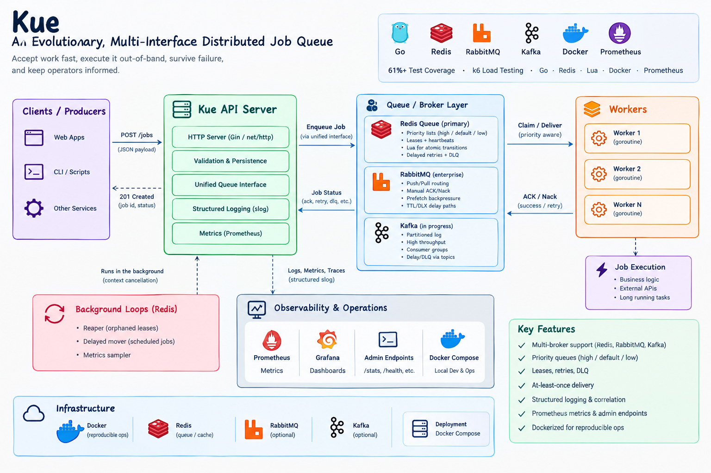

# Kue — An Evolutionary, Multi-Interface Distributed Job Queue

**Kue** is a distributed job orchestration engine still in progress and written in **Go**, with execution routes over **Redis**, **RabbitMQ**, and **Apache Kafka** with a common interface **Job Service** that contains all the specified functionality a broker must have natively to be able run the orchestration (`Push/Claim/ACK/Nack/Schedule`) and **job Store** which persists job status currently implemented with **Redis** and later **Postgres**, job enqueuing is done with Saving the job state in the job store b4 pushing to Message Broker (Redis/RabbitMQ/Apache Kafka)packaged with **Docker** for reproducible ops.  
It turns “run this work later, safely, under failure” into an explicit systems problem—leases, retries, priorities, and broker trade-offs.

`61%+ Automated Test Coverage (Unit & Integration)` · `Production-Scale Simulation (k6)` · `Go · Redis · Lua · Docker · Prometheus`

**k6 test** achieved a 13ms p(95) latency with a sustained peak target of 300 Requests Per Second (RPS)
---

## System Architecture for Kue

<p align="center">
  
</p>

## The narrative: the evolution of Kue (STAR)

### Situation
Kue began as a **sandbox**—a place to feel the physics of concurrent workers, network polling, shared state, and what happens when a process dies mid-job. The first version was deliberately small: one queue, one mental model, many sharp edges left visible.

### Task
**Caution**: The mentioning of AnyCompany wasn't intended as a real company but as a device to help demonstrate use case of the tool in a real world scenario

The bar moved. The goal became a **robust infrastructure engine** for real concurrency patterns:

- high-throughput work paths in the spirit of **AnyCompany Finance Crew** (time-critical, failure-intolerant pipelines), and  
- large parallel job fan-out in the spirit of **AnyCompany Printing Company** (bulk, prioritized, retryable rendering and processing).

Same product question in both worlds: **accept work fast, execute it out-of-band, survive worker death, and keep operators informed.**

### Action
The core engine was pushed toward a **unified interface layer** so transport could evolve without rewriting the worker brain:

1. **DIY Redis queue** — ultra-fast, in-memory distribution; **priority lists**; **visibility leases**; **Lua** for atomic multi-key transitions; heartbeats; delayed retries; DLQ.  
2. **RabbitMQ interface** — enterprise push/pull routing, manual **ACK/Nack**, prefetch **backpressure**, TTL/DLX-style delay paths.  
3. **Kafka** (in progress) — Partitioned log, Throughput, replay, consumer groups | Different model: offsets ≠ Redis leases; delay/DLQ via topics

Around that: fail-fast config, structured **slog** correlation (`request_id` / `job_id`), Prometheus metrics, admin endpoints, and Compose-based observability.

### Result
Kue is a **plug-and-play orchestration layer**: clients get **fast HTTP acceptance**; workers own execution; delivery stays **at-least-once** under crash; priorities, retries, and DLQ are explicit. Load simulation with **k6** showed stable enqueue/read paths under concurrent VUs with **sub‑10ms p95** on local runs once routing and status codes were correct.

> **In one line:** accept instantly, process asynchronously, recover on failure, measure everything.

---

## Deep-dive: solving the low-latency puzzle

**Asynchronous execution**  
`POST /jobs` validates, persists job state, and enqueues—then returns. Heavy work never sits on the request goroutine. Clients feel **instant acknowledgment**; the fleet does the real work.

**Atomic state transitions**  
Claim, schedule, extend-visibility, concurrency limits, and DLQ replay use **Redis primitives + Lua** where torn updates would lie. The app does not invent distributed locks for every transition; the data plane enforces the invariant.

**Goroutines & connection reuse**  
Workers are lightweight **goroutines**. Redis/Rabbit clients multiplex over long-lived connections instead of dial-per-job overhead. Background loops (reaper, delayed mover, metrics sampler on the Redis path) stay bounded by **context** cancellation for clean shutdown.

**Priority-aware ready queues**  
Ready work is not one silent list. **high → default → low** scheduling keeps urgent jobs from sitting behind bulk traffic—critical when “finance-like” and “print-batch-like” workloads share an engine.

---

## Enterprise-grade reliability & testing

### Coverage
Kue maintains **61%+ automated coverage** across unit and integration-style tests—focused on the paths that define correctness: claim/ack, reaper recovery, delayed retries, DLQ replay, priorities, config fail-fast, and HTTP admin surfaces.

### Split strategy
- **Unit tests** — **miniredis** and table-driven logic; assert state machines without a full cluster.  
- **Integration-style tests** — real Redis semantics in-process; **cmd/server** loops for reaper/mover/sampler; HTTP via `httptest`.  
- **Load simulation** — **k6** smoke + sustained enqueue scenarios against a live server.

### Zero-contamination policy
Each test gets an **isolated Redis** (miniredis) or a clean keyspace. No shared global queue state between cases. Metrics registration is **once-per-process** (`sync.Once`) so suites don’t false-fail on duplicate collectors. Fixtures set **priority** explicitly when the destination list matters.

### k6 (production-scale simulation)
Scripts hit `POST /jobs`, `GET /jobs/{id}`, and `/stats` under ramp profiles. Thresholds gate **error rate** and **p95 latency**. Green runs required fixing real issues first (duplicate routes, readiness, status codes)—not loosening SLOs.

---

## Hard-fought lessons learned

### Challenge → Resolution: k6 sufferring a 504 status code
**Challenge.** The First k6 run after modifying the job hander and worker interfaces showed **100% status code 504** and —then **80% failures** with checks at the sustained k6 test profile after the initial 20s smoke test.

**Resolution.** RabbitMQ AMPQ channels weren't implemented with mutex locks inorder to avoid race conditions and two or multiple workers trying to get access to it at the same time, so mutex locks where implemented

### Challenge → Resolution: job priorities vs legacy tests
**Challenge.** Moving from a single `jobs` list to **`jobs:high|default|low`** was a correct product change—and it **broke the suite**. Tests still asserted `LLEN jobs`. Empty priority normalized the wrong way. Producer type maps ignored explicit `priority`. Reaper/mover destinations and Stats disagreed with Push/Claim.

**Resolution.** Normalized **default** priority; **explicit API priority wins**; helpers like **`readyLen` / `Stats.MainDepth`**; fixtures carry priority; orphan leases **ZREM-only** (no nil deref). The lesson: **transport keys are part of the public contract of your tests.**

### Challenge → Resolution: k6 “100% failures” that weren’t the queue
**Challenge.** First k6 runs showed **100% `http_req_failed`** and **0 B received**—then **50% failures** with checks at 0% even when latency looked fine.

**Resolution.** Separate **connectivity** (server down, bad `BASE_URL`, Docker `localhost`) from **application status** (duplicate `/dead-jobs` mux panic, wrong expected codes). After a single ServeMux registration and honest checks, smoke and sustained profiles hit **0% errors** and **p95 enqueue in the low tens of milliseconds** locally.

### Challenge → Resolution: multi-broker semantics
**Challenge.** “One interface, three brokers” is easy to say and easy to lie about. Redis **leases + heartbeats** are not Kafka **offsets**, and not Rabbit **unacked deliveries**.

**Resolution.** Keep a shared **worker-facing contract** (`Push/Claim/ACK/Nack/Schedule`), document what each backend **cannot** emulate 1:1, and only run Redis-specific loops (reaper/mover) when the backend owns that model. Honesty scales better than fake parity.

---

## Quick start

```bash
export REDIS_ADDR=localhost:6379
export WORKER_COUNT=3
go run ./cmd/server
```

```bash
curl -s -X POST http://127.0.0.1:8080/jobs \
  -H 'Content-Type: application/json' \
  -d '{"type":"print","priority":"high","payload":{"name":"Kue"}}'
```

```bash
go test ./... -race -count=1
k6 run -e BASE_URL=http://127.0.0.1:8080 load/k6/smoke.js
```

---

## Design posture

| Promise | Mechanism |
|---------|-----------|
| Fast accept | Async enqueue, thin HTTP path |
| Crash recovery | Leases + reaper (Redis) / unacked redelivery (Rabbit) / offset discipline (Kafka) |
| Controlled urgency | Priority ready queues |
| Poison isolation | DLQ + replay |
| Evidence | **61%+ tests** + **k6** thresholds |

**Kue** is not “another queue.” It is a documented journey from sandbox physics to **multi-interface orchestration**—built to be read by a curious Developers and people
